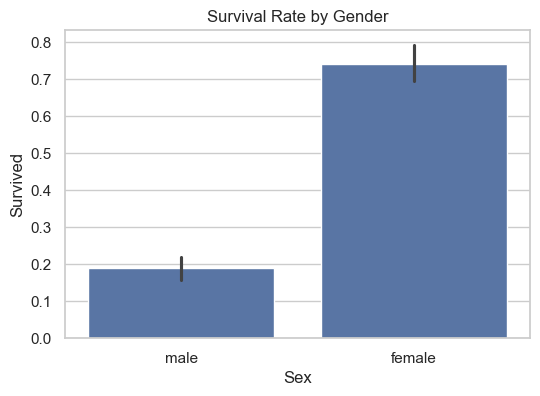

```python
import pandas as pd
import numpy as np
import matplotlib.pyplot as plt
import seaborn as sns

# Set style for plots
sns.set(style="whitegrid")

# 2. Load Dataset (Fix path issue using raw string)
df = pd.read_csv(r"E:\excell files\intership projects\raw dataset\train.csv")

# 3. Basic Information
print("\nData Info:")
df.info()

print("\nSummary Statistics:")
print(df.describe())

print("\nMissing Values:")
print(df.isnull().sum())

print("\nDuplicated Records:", df.duplicated().sum())

# 4. Univariate Analysis
plt.figure(figsize=(10, 4))
sns.histplot(df['Age'].dropna(), bins=30, kde=True)
plt.title("Age Distribution")
plt.show()

plt.figure(figsize=(6, 4))
sns.countplot(x='Survived', data=df)
plt.title("Survival Count")
plt.show()

plt.figure(figsize=(6, 4))
sns.boxplot(x='Fare', data=df)
plt.title("Fare Boxplot")
plt.show()

# 5. Bivariate Analysis
plt.figure(figsize=(6, 4))
sns.barplot(x='Sex', y='Survived', data=df)
plt.title("Survival Rate by Gender")
plt.show()

plt.figure(figsize=(6, 4))
sns.barplot(x='Pclass', y='Survived', data=df)
plt.title("Survival Rate by Class")
plt.show()

plt.figure(figsize=(6, 4))
sns.scatterplot(x='Age', y='Fare', hue='Survived', data=df)
plt.title("Age vs Fare Colored by Survival")
plt.show()

# 6. Multivariate Analysis
selected_features = ['Age', 'Fare', 'Pclass', 'Survived']
sns.pairplot(df[selected_features].dropna(), hue='Survived')
plt.suptitle("Pairplot of Selected Features", y=1.02)
plt.show()

plt.figure(figsize=(8, 6))
sns.heatmap(df.corr(numeric_only=True), annot=True, cmap='coolwarm', fmt=".2f")
plt.title("Correlation Heatmap")
plt.show()

# 7. Handling Missing Data
df['Age'] = df['Age'].fillna(df['Age'].median())
df['Embarked'] = df['Embarked'].fillna(df['Embarked'].mode()[0])

# 8. Skewness Check
print("\nSkewness:")
print(df.skew(numeric_only=True))

# Optional: Apply log transform to 'Fare' if needed
df['Fare_log'] = np.log1p(df['Fare'])

print("""
Summary:
- Majority of passengers did not survive (approx 62%).
- Women had significantly higher survival rate than men.
- Passengers in higher classes (1st) were more likely to survive.
- Age distribution is right-skewed; young adults form a large part.
- Fare has high outliers and right skew; log transformation helps.
- Strong correlation observed between Pclass and Fare.
- Missing data was found in Age, Cabin, and Embarked columns.
- Cabin was dropped due to too many missing values; others were imputed.
""")


```

    
    Data Info:
    <class 'pandas.core.frame.DataFrame'>
    RangeIndex: 891 entries, 0 to 890
    Data columns (total 12 columns):
     #   Column       Non-Null Count  Dtype  
    ---  ------       --------------  -----  
     0   PassengerId  891 non-null    int64  
     1   Survived     891 non-null    int64  
     2   Pclass       891 non-null    int64  
     3   Name         891 non-null    object 
     4   Sex          891 non-null    object 
     5   Age          714 non-null    float64
     6   SibSp        891 non-null    int64  
     7   Parch        891 non-null    int64  
     8   Ticket       891 non-null    object 
     9   Fare         891 non-null    float64
     10  Cabin        204 non-null    object 
     11  Embarked     889 non-null    object 
    dtypes: float64(2), int64(5), object(5)
    memory usage: 83.7+ KB
    
    Summary Statistics:
           PassengerId    Survived      Pclass         Age       SibSp  \
    count   891.000000  891.000000  891.000000  714.000000  891.000000   
    mean    446.000000    0.383838    2.308642   29.699118    0.523008   
    std     257.353842    0.486592    0.836071   14.526497    1.102743   
    min       1.000000    0.000000    1.000000    0.420000    0.000000   
    25%     223.500000    0.000000    2.000000   20.125000    0.000000   
    50%     446.000000    0.000000    3.000000   28.000000    0.000000   
    75%     668.500000    1.000000    3.000000   38.000000    1.000000   
    max     891.000000    1.000000    3.000000   80.000000    8.000000   
    
                Parch        Fare  
    count  891.000000  891.000000  
    mean     0.381594   32.204208  
    std      0.806057   49.693429  
    min      0.000000    0.000000  
    25%      0.000000    7.910400  
    50%      0.000000   14.454200  
    75%      0.000000   31.000000  
    max      6.000000  512.329200  
    
    Missing Values:
    PassengerId      0
    Survived         0
    Pclass           0
    Name             0
    Sex              0
    Age            177
    SibSp            0
    Parch            0
    Ticket           0
    Fare             0
    Cabin          687
    Embarked         2
    dtype: int64
    
    Duplicated Records: 0
    


    

    


    

    


    

    


    

    


    

    


    

    


    

    


    

    


    
    Skewness:
    PassengerId    0.000000
    Survived       0.478523
    Pclass        -0.630548
    Age            0.510245
    SibSp          3.695352
    Parch          2.749117
    Fare           4.787317
    dtype: float64
    
    Summary:
    - Majority of passengers did not survive (approx 62%).
    - Women had significantly higher survival rate than men.
    - Passengers in higher classes (1st) were more likely to survive.
    - Age distribution is right-skewed; young adults form a large part.
    - Fare has high outliers and right skew; log transformation helps.
    - Strong correlation observed between Pclass and Fare.
    - Missing data was found in Age, Cabin, and Embarked columns.
    - Cabin was dropped due to too many missing values; others were imputed.
    
    


```python

```
